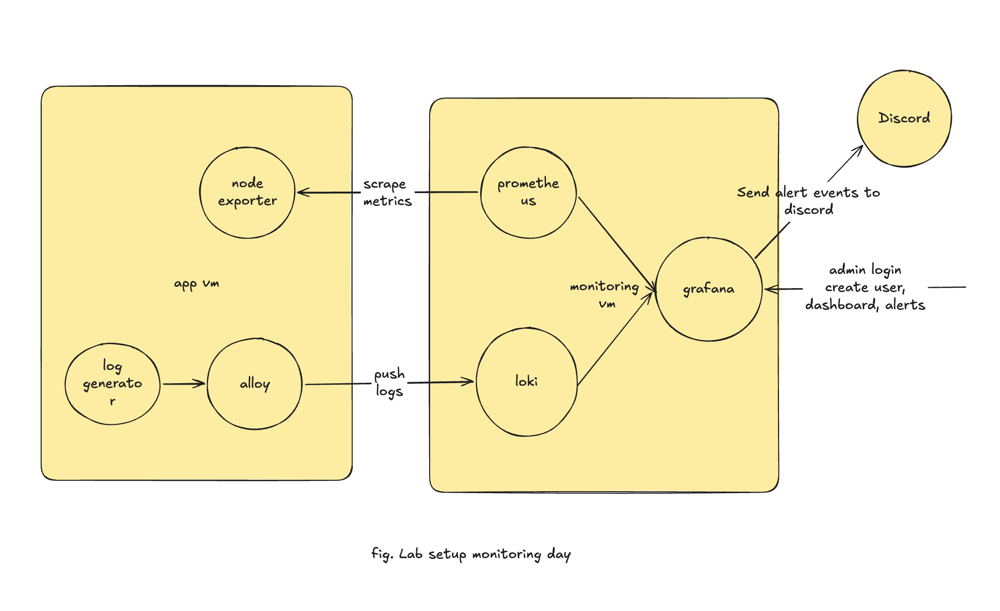
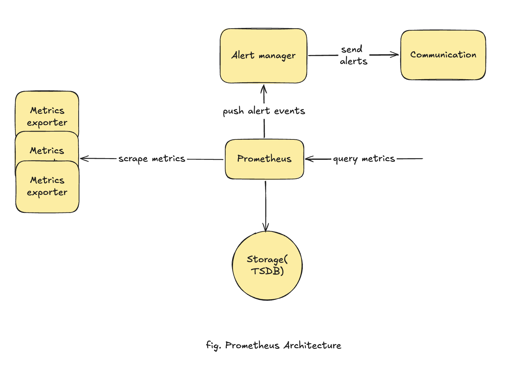
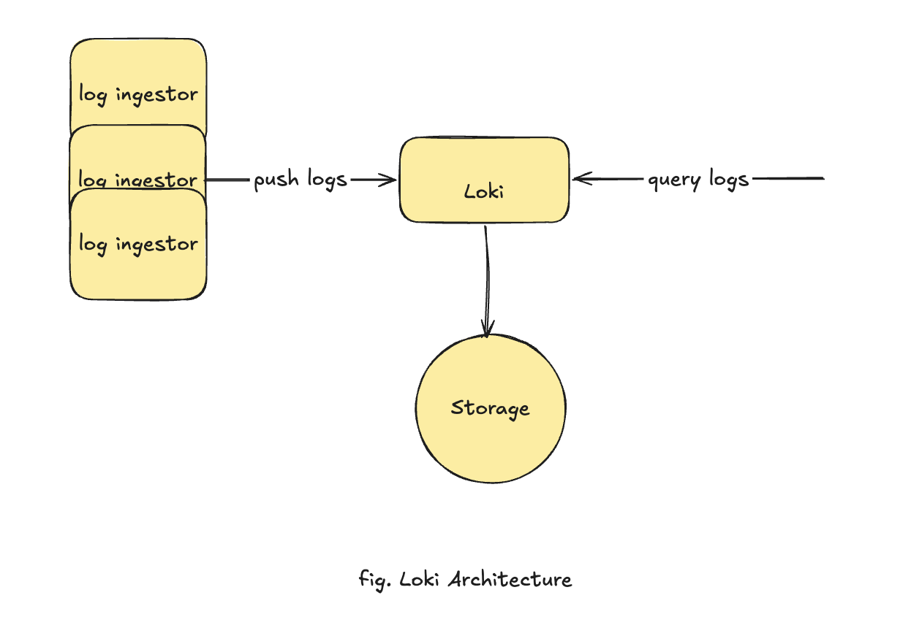

# Day 6 · Monitoring & Alerting

> You can't operate what you can't see. **Observability** is the practice of emitting enough signal — metrics, logs, traces — to know what a system is doing, why, and when it breaks. Today you stand up the classic open-source stack — **Prometheus** for metrics, **Loki** for logs, **Grafana** as the single pane of glass — and wire a **real alert to Discord**.

!!! info "What you'll run"
    Two EC2 hosts, provisioned by Terraform in [`examples/monitoring-app`](https://github.com/rbalman/devops-month/tree/main/examples/monitoring-app): an **app host** that emits metrics (node-exporter) and logs (a demo logger), and an **observability host** running Prometheus + Loki + Grafana that watches it over the network.

## Learning Objectives

- Explain **observability** vs monitoring, and the **three signals** — metrics, logs, traces — and when each helps
- Understand **Prometheus** (pull model, exporters, TSDB), the **four metric types**, and basic **PromQL**
- Understand **Loki** (label-based, not full-text) and basic **LogQL**, and how **Alloy** ships logs into it
- Use **Grafana** as one UI: a **dashboard**, log **Explore**, and an **alert to Discord**
- **Lab:** provision two EC2 hosts with Terraform, wire metrics + logs across the network, and fire a real Discord alert

---

## Prerequisites

- An **AWS account** with credentials configured (`aws configure`) and **Terraform** installed
- An existing **EC2 key pair** for SSH
- Basic comfort with **SSH** and the terminal — the lab drives two Linux hosts by hand
- A **Discord server** where you can create a webhook (Server Settings → Integrations → Webhooks)

!!! note "Cost"
    The lab runs **two `t3.micro` EC2 instances**. Remember to `terraform destroy` when you're done (there's a reminder at the end).

---

## Theory · ~45 min

### 1. What is observability?

**Monitoring** tells you *whether* something is wrong — you pick some checks up front (is the host up? is disk over 90%?) and get alerted when one trips. **Observability** goes further: it's about emitting enough data — **metrics, logs, and traces** — that you can also answer *why* it's wrong, including questions you didn't think to ask in advance.

In short: monitoring watches the things you knew to watch; observability lets you investigate the things you didn't. You need both — and this course sets up the tools that give you them.

### 2. The three signals

Observability is usually built on three **signals** (the "three pillars" of telemetry), each answering a different question:

| Signal | What it is | Answers | Tool (today) |
|---|---|---|---|
| **Metrics** | Numbers over time (request rate, CPU %, error count) | "*Is* something wrong, and how much?" | **Prometheus** |
| **Logs** | Timestamped text/JSON events | "*What* exactly happened?" | **Loki** |
| **Traces** | One request's path across services | "*Where* in the chain did it break/slow?" | Tempo / Jaeger — *skipped today* |

The typical workflow ties them together: a **metric** alert tells you something's wrong → you jump to **logs** to see what → in a distributed system a **trace** shows where. **We wire the first two today** and view both through Grafana. Traces (Grafana Tempo + OpenTelemetry) are a topic of their own.

!!! note "Tool per signal"
    Metrics → Prometheus · Logs → Loki (or Elasticsearch) · Traces → Tempo/Jaeger · **Visualisation & alerting** → Grafana sits on top of all of them. That "one UI, many stores" split is why Grafana is everywhere.

### 3. The stack we'll build

We run this across **two hosts** — one being watched, one doing the watching — so the signals actually cross the network, the way they would in real life:

{ width="720" }

| Host | Component | Role |
|---|---|---|
| App | **node-exporter** | Exposes host metrics (CPU, memory, disk) as a `/metrics` page |
| App | **random-logger** | Emits random `DEBUG`/`INFO`/`WARN`/`ERROR` lines — stands in for a real app |
| App | **Grafana Alloy** | Log collector — tails container stdout and ships it to the remote Loki |
| Obs | **Prometheus** | **Pulls** (scrapes) `/metrics` from the app host every 15s and stores the numbers |
| Obs | **Loki** | Stores logs — "Prometheus, but for logs" (label-indexed, cheap) |
| Obs | **Grafana** | One UI over both stores: dashboards, log search, alerting |

We deliberately keep the moving parts few: two stores, one shipper, one UI, one alert channel.

### 4. Prometheus — architecture

<iframe width="560" height="315" src="https://www.youtube.com/embed/STVMGrYIlfg" title="Introduction to the Prometheus Monitoring System" frameborder="0" allow="accelerometer; autoplay; clipboard-write; encrypted-media; gyroscope; picture-in-picture" allowfullscreen></iframe>

Prometheus is a **metrics database + scraper** in one binary. Its defining choice is the **pull model**: *Prometheus reaches out and scrapes* an HTTP `/metrics` endpoint on each target, rather than targets pushing to it. That means targets are dumb (just expose a page of numbers), and Prometheus decides what/when/how often.

{ width="640" }

Key ideas:

- **Exporters** translate something that doesn't speak Prometheus into a `/metrics` page — `node-exporter` for a host, `postgres_exporter` for a DB, etc. Apps can also expose metrics natively via a client library.
- **Time series** = a metric name + a set of **labels**, e.g. `node_cpu_seconds_total{cpu="0", mode="idle"}`. Each unique label combo is its own series — so keep labels **low-cardinality** (never put a raw user id or request id in a label).
- **Storage** is a local **TSDB**; Prometheus is built to be run per-environment, not as one giant global instance.
- **Alertmanager** is a *separate* component for routing/grouping/silencing alerts. Today we let **Grafana** do alerting instead (one less moving part) and note Alertmanager as the Prometheus-native path.

### 5. The four metric types

A client library / exporter gives you four types. Know when each is used:

| Type | Goes | Use for | node-exporter example |
|---|---|---|---|
| **Counter** | only up (resets on restart) | totals of events | `node_network_receive_bytes_total` |
| **Gauge** | up **and** down | a current value | `node_memory_MemAvailable_bytes` |
| **Histogram** | buckets of observations | latency/size distributions → **quantiles** | `prometheus_http_request_duration_seconds_bucket` |
| **Summary** | client-side quantiles | quantiles when you can't aggregate | rare; prefer histograms |

Rule of thumb: **count things → Counter; measure a level → Gauge; time/size things → Histogram.** You almost never need Summary.

### 6. PromQL in five minutes

PromQL queries those time series. The essentials (all runnable against this stack):

```promql
# Instant selector — current value of a series (with a label filter)
node_memory_MemAvailable_bytes

# rate() over a 5-minute window — per-second rate of a counter (the #1 pattern)
rate(node_network_receive_bytes_total[5m])

# Aggregate away labels — total across all CPUs, grouped by mode
sum by (mode) (rate(node_cpu_seconds_total[5m]))

# CPU busy % = 1 − idle fraction
100 * (1 - avg(rate(node_cpu_seconds_total{mode="idle"}[5m])))

# p95 from a histogram
histogram_quantile(0.95, sum by (le) (rate(prometheus_http_request_duration_seconds_bucket[5m])))

# Is a target down? (up is 1 when a scrape succeeds, 0 when it fails)
up{job="node"} == 0
```

Two things trip people up: you almost always wrap a **counter** in `rate(...)` (the raw number is meaningless — only its *slope* matters), and `[5m]` is a **range** `rate()` needs, not a filter.

### 7. Loki — architecture

<iframe width="560" height="315" src="https://www.youtube.com/embed/0B-yQdSXFJE" title="Mastering Grafana Loki" frameborder="0" allow="accelerometer; autoplay; clipboard-write; encrypted-media; gyroscope; picture-in-picture" allowfullscreen></iframe>

Loki is a **log store designed to be cheap**. Its trick: unlike Elasticsearch, it does **not** full-text index your logs. It indexes only a small set of **labels** (like `container="random-logger"`), stores the raw log lines compressed in object storage, and does text filtering at **query time** by brute force over the matched streams. Fewer indexes → far cheaper to run, at the cost of slower ad-hoc text search over huge ranges.

{ width="640" }

Notice the shape mirrors Prometheus: shippers **push logs** in (where Prometheus **pulls** metrics), Loki writes to **storage**, and you **query logs** back out.

A **log stream** = a unique set of labels. Same discipline as Prometheus: **labels are low-cardinality** (`container`, `level`), and everything else stays in the log line, filtered with LogQL. In production Loki splits into distributor/ingester/querier components; today we run the **single-binary** mode — one container, filesystem storage.

### 8. Alloy — the log shipper

<iframe width="560" height="315" src="https://www.youtube.com/embed/Xa3mCIdsno4" title="How to Send Logs to Grafana Using Alloy" frameborder="0" allow="accelerometer; autoplay; clipboard-write; encrypted-media; gyroscope; picture-in-picture" allowfullscreen></iframe>

Loki doesn't collect logs; something has to *push* them in. Older tutorials use **Promtail** — it reached **end-of-life in early 2026**. Its replacement is **Grafana Alloy**, a single collector (built on the OpenTelemetry Collector) that can carry logs, metrics, *and* traces. Its pipeline is a chain of **components**:

```text
discovery.docker  ──▶  discovery.relabel  ──▶  loki.source.docker  ──▶  loki.write
(find containers)      (tidy the labels)       (tail their stdout)      (push to Loki)
```

Each block declares one component and wires its output into the next. We point it at the Docker socket so it auto-discovers every container in the stack.

### 9. Grafana — the single pane of glass

<iframe width="560" height="315" src="https://www.youtube.com/embed/lILY8eSspEo" title="Grafana Explained in Under 5 Minutes" frameborder="0" allow="accelerometer; autoplay; clipboard-write; encrypted-media; gyroscope; picture-in-picture" allowfullscreen></iframe>

Grafana **stores nothing** — it queries **data sources** you register (Prometheus, Loki). From one UI you get **dashboards** (PromQL/LogQL panels), **Explore** (ad-hoc queries, great for logs), and **alerting** (which we set up hands-on in the lab). Metrics, logs, *and* alerts from one place — that's what keeps the moving parts few.

Grafana can be configured two ways: click through the UI, or **provision** from files (data sources, dashboards) so the setup is reproducible. We provision the data sources so they're wired the moment Grafana boots.

---

## Lab · ~60 min

You'll provision **two EC2 hosts** with Terraform, then SSH in and bring the stack up **by hand — Prometheus first, then Loki, then Grafana** — so you watch each signal light up. Everything is in [`examples/monitoring-app`](https://github.com/rbalman/devops-month/tree/main/examples/monitoring-app).

### 1. Provision the two hosts (Terraform)

Clone the repo on your laptop and move into the Terraform project:

```bash
git clone https://github.com/rbalman/devops-month.git
cd devops-month/examples/monitoring-app/terraform
```

This project creates an **app host** and an **observability host** in your default VPC, opens a security group (SSH + the UIs open to the world; all traffic between the two hosts), and installs **Docker + Compose** on each via `user_data`.

Set your variable — open `terraform.tfvars` and fill in `key_name` (an existing EC2 key pair):

```bash
cp terraform.tfvars.example terraform.tfvars
```

Then provision:

```bash
terraform init
terraform apply
```

When it finishes, print the host IPs — you'll paste these in the next steps:

```bash
terraform output
# app_public_ip, app_private_ip, observability_public_ip, observability_private_ip
```

Wait about a minute after `apply` for `user_data` to finish installing Docker on both hosts.

### 2. App host — generate the signals

SSH in and fetch the files:

```bash
ssh -i <your-key.pem> ubuntu@<app_public_ip>
git clone https://github.com/rbalman/devops-month.git
cd devops-month/examples/monitoring-app/app-instance
```

Point Alloy at the **observability host's private IP**, then start the signal generators (node-exporter + random-logger + Alloy):

```bash
sed -i "s/OBS_PRIVATE_IP/<observability_private_ip>/" alloy/config.alloy
docker compose up -d
docker compose ps
```

Confirm metrics are exposed and logs are flowing:

```bash
curl -s localhost:9100/metrics | head        # node-exporter is serving metrics
docker compose logs --tail=5 random-logger   # random log lines
```

Alloy will keep **retrying** its push to Loki until you start Loki in step 4 — that's expected.

### 3. Observability host — Prometheus first

In a second terminal, SSH into the observability host and fetch the files:

```bash
ssh -i <your-key.pem> ubuntu@<observability_public_ip>
git clone https://github.com/rbalman/devops-month.git
cd devops-month/examples/monitoring-app/observability-instance
```

Point Prometheus at the **app host's private IP**, then bring up **just Prometheus**:

```bash
sed -i "s/APP_PRIVATE_IP/<app_private_ip>/" prometheus/prometheus.yml
docker compose up -d prometheus
```

Open **`http://<observability_public_ip>:9090` → Status → Targets** — the `node` job should be **UP**. Then try some PromQL in **Graph**:

```promql
100 * (1 - avg(rate(node_cpu_seconds_total{mode="idle"}[5m])))   # CPU busy % on the app host
node_memory_MemAvailable_bytes                                   # free memory
```

Metrics, end to end, across two machines.

### 4. Then Loki

```bash
docker compose up -d loki
```

Loki now accepts the pushes Alloy has been retrying from the app host. Give it a few seconds.

Sanity-check that logs are actually arriving — **without Grafana** — by hitting Loki's HTTP API directly on the observability host:

```bash
# Loki is up and ready
curl -s localhost:3100/ready

# Which container log streams have arrived? Expect "random-logger", "alloy", …
curl -s localhost:3100/loki/api/v1/label/container/values

# Pull a few recent lines from the app's logger
curl -sG localhost:3100/loki/api/v1/query_range \
  --data-urlencode 'query={container="random-logger"}' \
  --data-urlencode 'limit=5'
```

If the label values are empty, Alloy isn't reaching Loki yet — recheck `OBS_PRIVATE_IP` in `alloy/config.alloy` on the app host. (Add `| jq` for readable JSON; `sudo apt-get install -y jq` if needed.)

### 5. Then Grafana

```bash
docker compose up -d grafana
```

Open **`http://<observability_public_ip>:3000`** and log in with `admin` / `admin`.

Now add the two data sources **by hand**. Go to **Connections → Data sources → Add data source**, and add each of these:

- **Prometheus**

    Set **URL** to `http://prometheus:9090`, then click **Save & test**.

- **Loki**

    Set **URL** to `http://loki:3100`, then click **Save & test**.

Grafana reaches them by service name because all three share the Compose network on this host.

### 6. A dashboard

**Dashboards → New → Import**, ID **1860** (*Node Exporter Full*), pick Prometheus. Instant CPU/mem/disk/network for the **app host**, live.

### 7. Query logs in Explore

**Explore** (compass icon) → **Loki** → run:

```logql
{container="random-logger"}                 # all app-host logs, streaming
{container="random-logger"} |= "ERROR"      # just the error lines
```

Logs from the *other* machine, in the same UI as its metrics.

### 8. Alert to Discord

Alerting in Grafana is two pieces: a **contact point** (where a notification goes — here, a **Discord webhook**) and an **alert rule** (a query + condition that fires once it stays true for a set duration). No separate Alertmanager to run.

Create a Discord webhook (Server Settings → Integrations → Webhooks), add it as a **Discord contact point** in Grafana, then write a rule against something that *actually* matters — for example:

- **A host is down** — `up{job="node"} == 0`
- **Disk filling up** — free space on the app host drops below, say, 15%
- **Errors spiking** — more than 5 `ERROR` lines in the last few minutes (a LogQL rule over Loki)

Give the rule a **`for`** duration (e.g. `1m`) so it fires only when the condition persists, point it at your Discord contact point, and save. Trigger one — e.g. `docker compose stop node-exporter` on the app host — and watch it go **Pending → Firing** in Discord, then **resolved** when you bring it back.

!!! success "You closed the loop"
    Metrics and logs from one host, monitored from another, unified in Grafana with a real alert to Discord — your system now tells *you* when something's wrong. That's production-grade observability from open-source parts.

!!! danger "Tear down when done"
    Two EC2 instances bill by the hour. From your laptop: `cd examples/monitoring-app/terraform && terraform destroy`.

---

## Advanced Topics

- **Instrument your own app** — expose a `/metrics` endpoint with a client library and scrape it; add **cAdvisor** for per-container metrics → [Prometheus client libraries](https://prometheus.io/docs/instrumenting/clientlibs/) · [cAdvisor](https://github.com/google/cadvisor)
- **Alertmanager** — the Prometheus-native way to route/group/silence alerts if you outgrow Grafana alerting → [Alertmanager docs](https://prometheus.io/docs/alerting/latest/alertmanager/)
- **Recording rules & SLOs** — pre-compute expensive queries; alert on user-facing objectives, not raw CPU → [Prometheus recording rules](https://prometheus.io/docs/prometheus/latest/configuration/recording_rules/) · [Google SRE — SLOs](https://sre.google/workbook/implementing-slos/)
- **Dashboards & alerts as code** — provision dashboards and alert rules from files like we did data sources → [Grafana provisioning](https://grafana.com/docs/grafana/latest/administration/provisioning/)
- **Traces — the third signal** — Grafana **Tempo** + OpenTelemetry, correlated with metrics & logs → [Tempo docs](https://grafana.com/docs/tempo/latest/)

---

## Assignment

**Goal:** add a new **exporter** to the app host and fire a Discord alert from one of *its* metrics. Recommended exporter: **cAdvisor** — "node-exporter, but for containers." It's a single container, needs no config file, and the app host is already running containers worth measuring.

**Steps**

1. **Run cAdvisor on the app host.** Add it to `app-instance/docker-compose.yml` as a new service (hint below), then `docker compose up -d`.
2. **Scrape it.** Add a `cadvisor` job to the observability host's `prometheus.yml` pointing at the app host's private IP, then restart Prometheus (`docker compose restart prometheus`).
3. **Verify.** In Prometheus → **Status → Targets**, the `cadvisor` job should be **UP**. Try a query, e.g. `container_memory_usage_bytes`.
4. **Alert.** Create a Grafana alert rule on a cAdvisor metric, routed to your Discord contact point — for example a container over a memory threshold:
   ```promql
   container_memory_usage_bytes{name="random-logger"} > 50e6
   ```
5. **Trigger & resolve.** Force it to fire (lower the threshold, or load the container), then bring it back and confirm the resolved notice.

**Hint — cAdvisor as a Compose service** (in `app-instance/docker-compose.yml`):

```yaml
  cadvisor:
    image: gcr.io/cadvisor/cadvisor:v0.60.5
    ports: ["8080:8080"]
    volumes:
      - /:/rootfs:ro
      - /var/run:/var/run:ro
      - /sys:/sys:ro
      - /var/lib/docker/:/var/lib/docker:ro
    restart: unless-stopped
```

**Hint — the scrape job** (in `observability-instance/prometheus/prometheus.yml`):

```yaml
  - job_name: cadvisor
    static_configs:
      - targets: ["APP_PRIVATE_IP:8080"]
```

**Submit:** your updated `docker-compose.yml` + `prometheus.yml`, a screenshot of the `cadvisor` target **UP** in Prometheus, and the **Discord alert** (firing + resolved).

---

## Further Reading

The intro videos for each tool are embedded in the theory sections above. Official docs for going deeper:

- **Prometheus:** [Getting started](https://prometheus.io/docs/prometheus/latest/getting_started/) · [Metric types](https://prometheus.io/docs/concepts/metric_types/) · [PromQL basics](https://prometheus.io/docs/prometheus/latest/querying/basics/) · [node_exporter](https://github.com/prometheus/node_exporter)
- **Grafana:** [Fundamentals](https://grafana.com/tutorials/grafana-fundamentals/) · [Data sources](https://grafana.com/docs/grafana/latest/datasources/) · [Alerting](https://grafana.com/docs/grafana/latest/alerting/) · [Discord contact point](https://grafana.com/docs/grafana/latest/alerting/configure-notifications/manage-contact-points/integrations/configure-discord/)
- **Loki & Alloy:** [Loki docs](https://grafana.com/docs/loki/latest/) · [LogQL](https://grafana.com/docs/loki/latest/query/) · [Alloy docs](https://grafana.com/docs/alloy/latest/)
